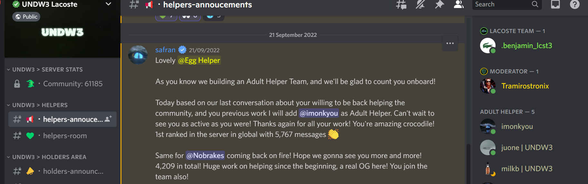

# Web3 Community Operations Portfolio

Hi, I'm Emmanuel Abbah.

I specialize in Web3 community operations and moderation, helping projects build safe, engaged, and well-managed communities across Discord and Web3 ecosystems.

My work focuses on community support, moderation, onboarding, security, and working closely with founders to maintain healthy and active communities.

---

## Founder Communication

---

## Community Recognition

---

## Moderator & Admin Roles

---

## Community Engagement

---

## Ambassador Role

---

## Skills

• Discord Community Moderation  
• Web3 Community Management  
• User Support & Onboarding  
• Scam & Spam Protection  
• Community Engagement  
• Founder Communication  
• Server Management  
• Moderator Team Coordination  

---

## About Me

I have worked with multiple Web3 communities supporting founders and helping manage active Discord servers. My experience includes moderation, managing roles, assisting community members, and helping projects maintain healthy engagement.

---

## Contact

LinkedIn:https://www.linkedin.com/in/emmanuelabbah/ 
GitHub: https://github.com/nobrakesnft
