# Web3 Community Operations Portfolio

Hi, I'm Emmanuel Abbah.

I specialize in Web3 community operations, moderation, and engagement across Discord communities.

My work includes moderation, community support, onboarding new members, and helping founders manage healthy Web3 communities.

---

## Founder Communication

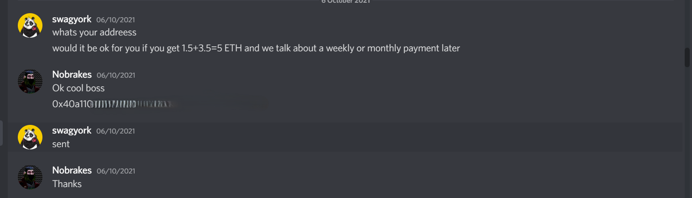

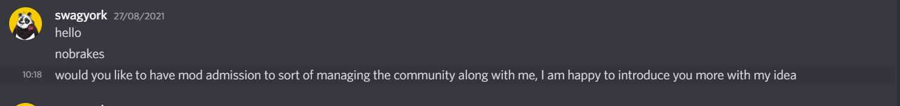

---

## Community Recognition

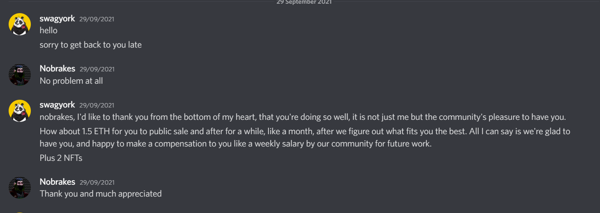

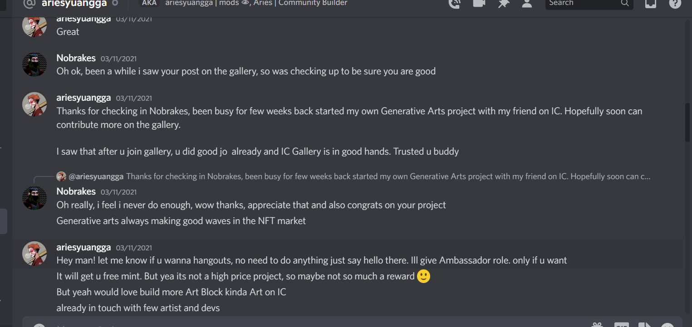

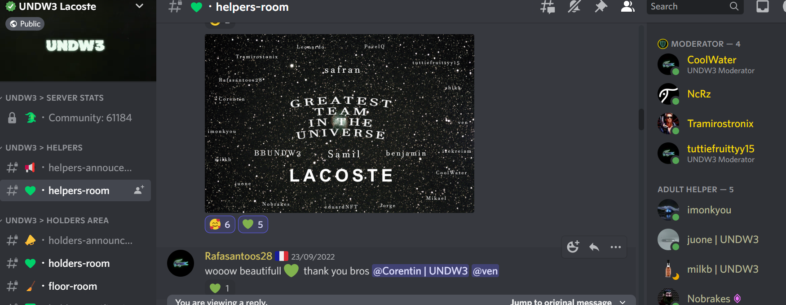

---

## Moderator & Admin Roles

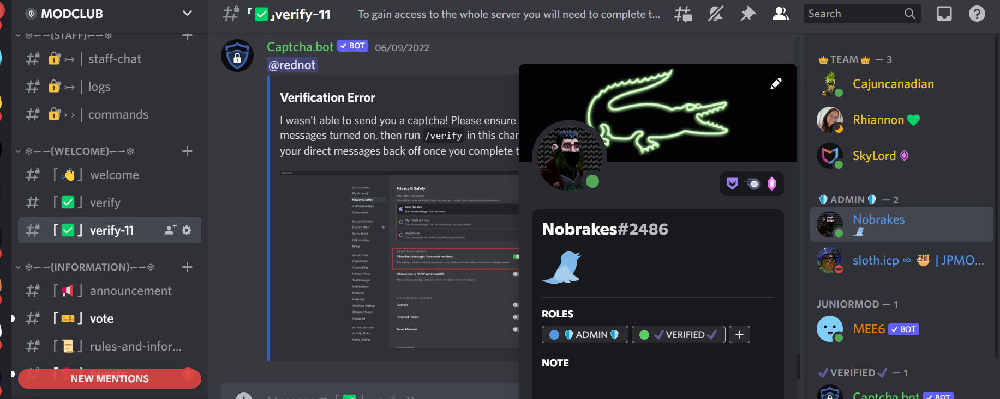

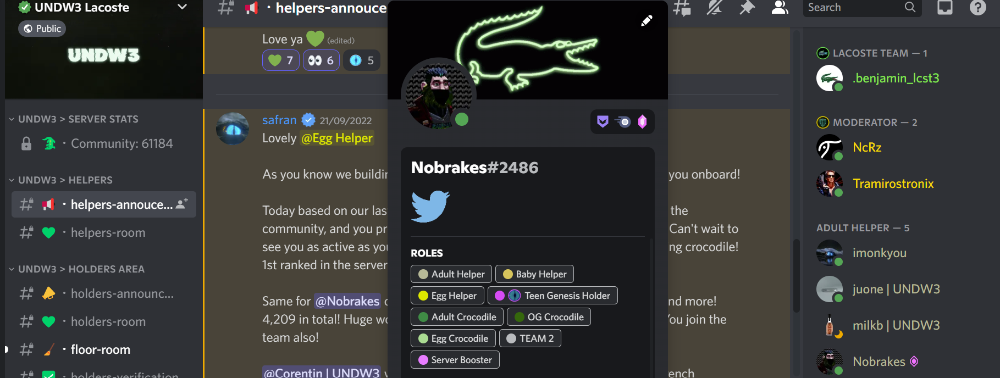

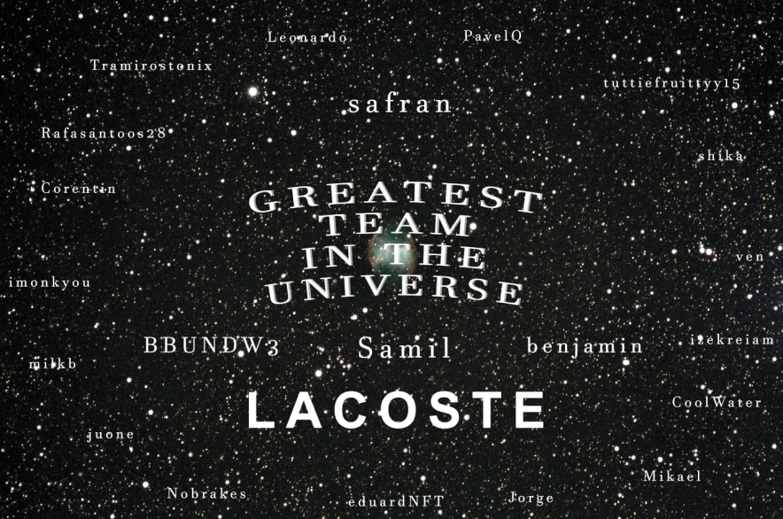

---

## Community Engagement

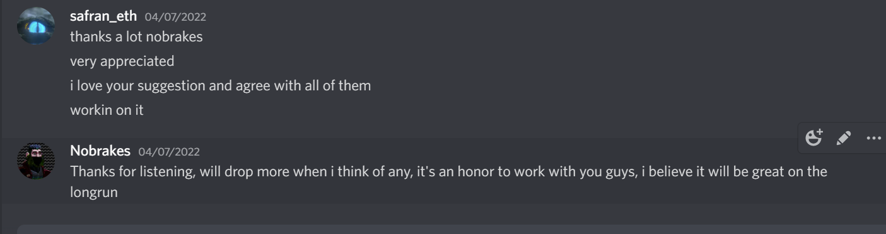

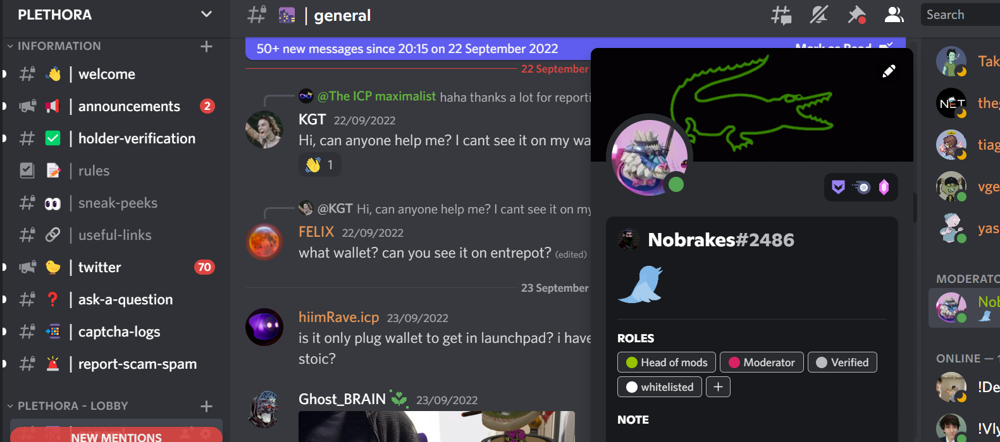

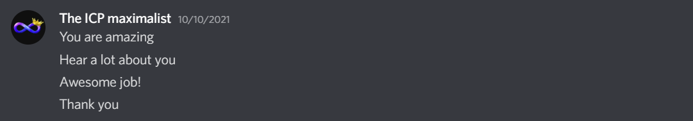

---

## Ambassador Role

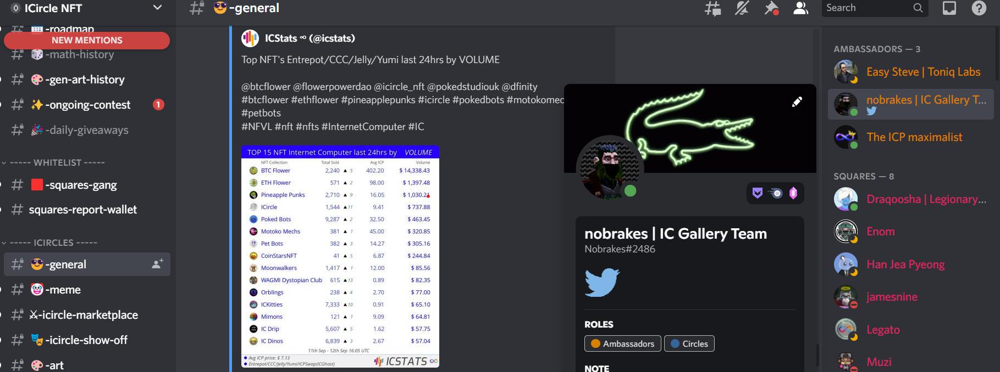

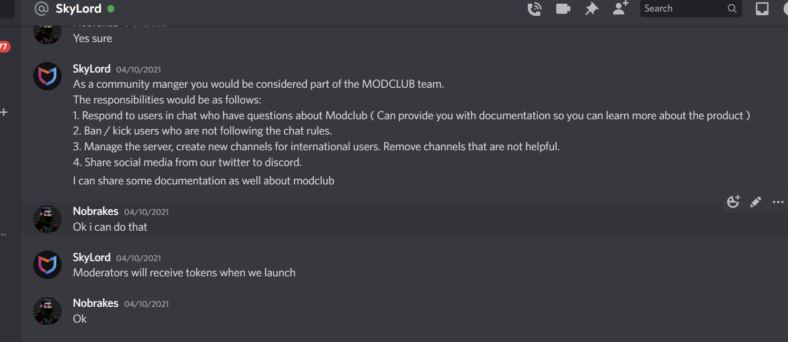

---

## Skills

• Discord Community Management  
• Web3 Community Moderation  
• User Support & Onboarding  
• Anti-Spam & Scam Protection  
• Community Engagement  
• Founder Communication  

---

## Contact

LinkedIn: https://linkedin.com](https://www.linkedin.com/in/emmanuelabbah/
